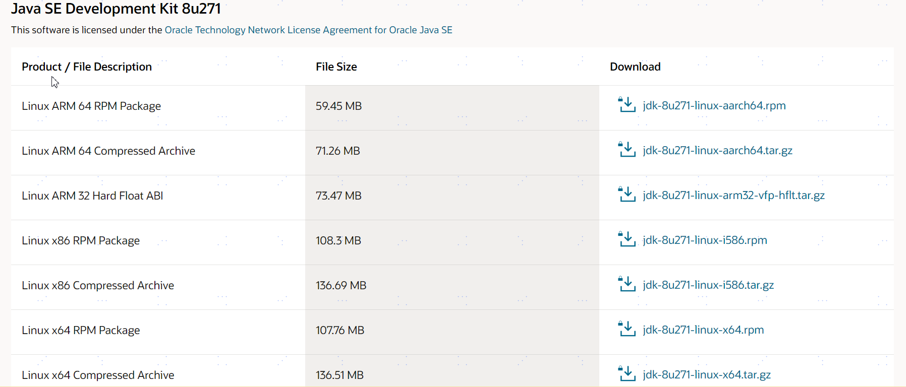
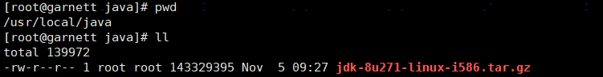
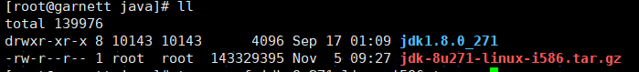
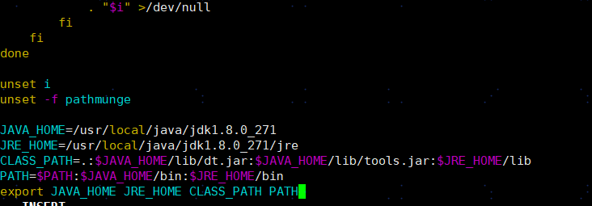
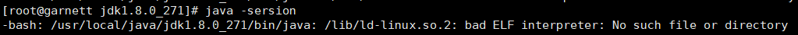
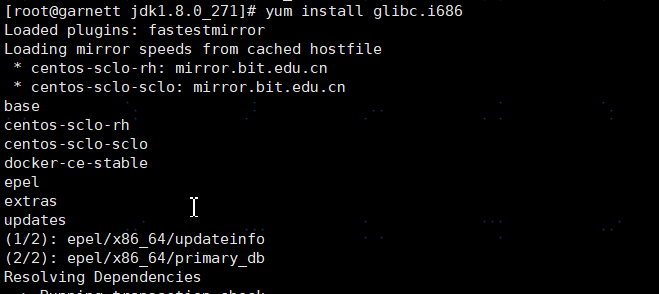
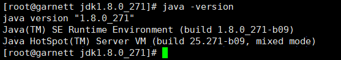

此处记录一下在阿里云服务器安装JDK1.8的步骤。

1、下载JDK

　　当前最新版本下载地址：http://www.oracle.com/technetwork/java/javase/downloads/index.html

　　历史版本下载地址：　　http://www.oracle.com/technetwork/java/javase/archive-139210.html  



2、创建目录`/usr/local/java`，将下载的安装包使用xftp等工具上传到此目录



3、通过 `rpm -qa | grep java` 命令查看是否安装过 jdk


我的显示没有安装，如果安装了，通过 `rpm -e xxx --nodeps` 命令进行装卸，xxx表示你通过 `rpm -qa | grep java` 命令 查到的安装包的名字。

4、解压`tar -zxvf jdk-8u271-linux-i586.tar.gz`



5、通过 `vim /etc/profile` 命令来编辑环境变量的配置文件

在文档底部插入如下内容：

```
export JAVA_HOME=/usr/local/java/jdk1.8.0_271
export CLASSPATH=.:${JAVA_HOME}/jre/lib/rt.jar:${JAVA_HOME}/lib/dt.jar:${JAVA_HOME}/lib/tools.jar
export PATH=$PATH:${JAVA_HOME}/bin
```



6、通过 `source /etc/profile` 命令使更改的配置立即生效

7、查看版本发现报错



解决办法：执行sudo yum install glibc.i686，中间会问安装一些依赖包，输入y：





再次查看可以看到已经安装成功了。